# AfyaPass Entity-Relationship Diagram (ERD)

## Overview
The AfyaPass database schema comprises 34 domain entities organized across 11 architectural domains: Identity, Organization, User/Staff Identity, Clinical, Pharmacy, Laboratory, Referrals, Patient Credentials, Access Control, Documents, and Audit/Security.

## Mermaid ERD Visualization

```mermaid
erDiagram
    counties ||--o{ sub_counties : "contains"
    sub_counties ||--o{ facilities : "contains"
    facilities ||--o{ departments : "has"
    facilities ||--o{ facility_user_roles : "employs"

    user_profiles ||--o{ healthcare_workers : "has"
    user_profiles ||--o{ facility_user_roles : "assigned"
    roles ||--o{ facility_user_roles : "grants"
    roles ||--o{ role_permissions : "contains"
    permissions ||--o{ role_permissions : "mapped"

    patients ||--o{ patient_identifiers : "identifies"
    patients ||--o{ patient_contacts : "reaches"
    patients ||--o{ patient_addresses : "resides"
    patients ||--o{ patient_relationships : "relates"
    patients ||--o{ external_identifiers : "links"
    patients ||--o{ patient_cards : "issued"

    patient_cards ||--o{ qr_tokens : "generates"

    patients ||--o{ encounters : "attends"
    facilities ||--o{ encounters : "hosts"
    user_profiles ||--o{ encounters : "conducts"

    encounters ||--o{ observations : "records"
    encounters ||--o{ diagnoses : "identifies"
    encounters ||--o{ clinical_notes : "contains"
    encounters ||--o{ procedures : "performs"
    encounters ||--o{ care_plans : "establishes"

    patients ||--o{ allergies : "has"

    medications ||--o{ prescriptions : "specified_in"
    encounters ||--o{ prescriptions : "generates"
    prescriptions ||--o{ dispensing : "dispenses"

    encounters ||--o{ lab_orders : "orders"
    lab_orders ||--o{ lab_order_items : "contains"
    lab_order_items ||--o{ lab_results : "produces"

    encounters ||--o{ referrals : "originates"
    facilities ||--o{ referrals : "refers_to"
    referrals ||--o{ referral_events : "tracks"

    patients ||--o{ consents : "authorizes"
    patients ||--o{ access_requests : "requests"
    patients ||--o{ documents : "attaches"

    patients ||--o{ audit_events : "logs_patient"
    user_profiles ||--o{ audit_events : "logs_actor"
    user_profiles ||--o{ security_events : "triggers_security"

    patients ||--o{ provenance : "tracks_origin"
```

## Domain Structure & Cardinalities

### 1. Identity Domain
- `patients (1) <---> (0..*) patient_identifiers`: A patient has multiple encrypted/hashed identifiers (e.g. National ID, Birth Cert).
- `patients (1) <---> (0..*) patient_contacts`: Phone numbers and email addresses.
- `patients (1) <---> (0..*) patient_addresses`: Physical residential locations across sub-counties.
- `patients (1) <---> (0..*) patient_relationships`: Links between patients (Child -> Mother, Adult -> Guardian). Does NOT automatically grant medical record access.
- `patients (1) <---> (0..*) external_identifiers`: Cross-system EHR pointers.

### 2. Organization Domain
- `counties (1) <---> (1..*) sub_counties`: Geographic administrative boundaries (e.g., Murang'a County -> Kiharu Sub-County).
- `sub_counties (1) <---> (0..*) facilities`: Healthcare sites registered under MFL.
- `facilities (1) <---> (0..*) departments`: Outpatient, Emergency, Pharmacy, Laboratory.

### 3. User & Staff Identity Domain
- `user_profiles (1) <---> (0..1) healthcare_workers`: User account to clinician credentials.
- `user_profiles (1) <---> (0..*) facility_user_roles`: Multi-facility assignment matrix (Doctor at Facility A, Nurse at Facility B).
- `roles (1) <---> (0..*) role_permissions (0..*) <---> (1) permissions`: Granular permission mappings.

### 4. Clinical Domain
- `patients (1) <---> (0..*) encounters`: Central clinical event linking Patient, Facility, and Provider.
- `encounters (1) <---> (0..*) observations`: Structured vital signs and measurements.
- `encounters (1) <---> (0..*) diagnoses`: ICD-11 coded conditions.
- `encounters (1) <---> (0..*) clinical_notes`: Protected clinical summaries.
- `encounters (1) <---> (0..*) procedures`: Medical/surgical procedures performed.
- `patients (1) <---> (0..*) allergies`: Patient allergy alerts.

### 5. Pharmacy & Lab Domains
- `encounters (1) <---> (0..*) prescriptions <---> (0..*) dispensing`: Controlled medication orders and pharmacy fulfillment.
- `encounters (1) <---> (0..*) lab_orders <---> (0..*) lab_order_items <---> (0..*) lab_results`: Laboratory workflow and results.

### 6. Credentials & Access Control
- `patients (1) <---> (0..*) patient_cards <---> (0..*) qr_tokens`: Physical laminated cards and random revocable QR token references.
- `patients (1) <---> (0..*) consents & access_requests`: Authorization policies and emergency overrides.

### 7. Audit & Provenance
- `audit_events`, `security_events`, `provenance`: Immutable append-only audit trail logging every clinical access and modification.
